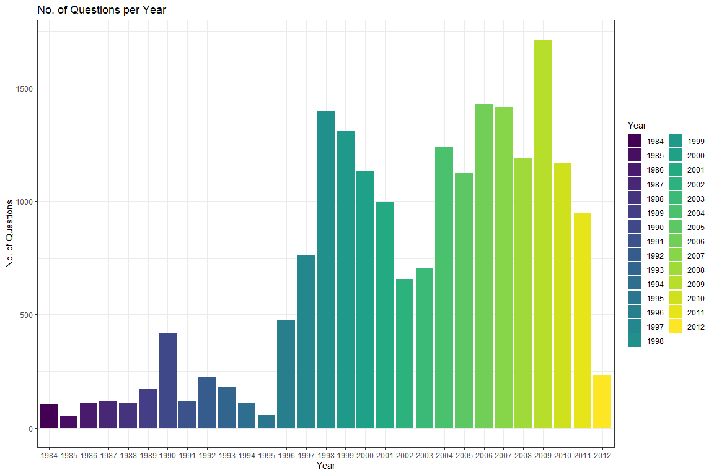

<style type="text/css">
  body{
  font-size: 12pt;
  font-family: 'Monaco', 'Courier New', monospace;
}
</style>

## Background

Jeopardy is a very popular TV show in North America where participants
answer trivia questions to win money.Contestants are presented with a
range of categories and a series of questions that escalate in
difficulty. With each correct answer, participants have the opportunity
to accumulate higher monetary rewards as the difficulty of the questions
increases.

Contestants can earn a lot of money especially if they have multi-game
win streaks. To achieve this some contestants will try to maximize their
chances by focusing more on topics that are more likely to be asked
about. In this analysis we will try to do the same on a rudimentary
scale.

## Small Talk with the Data

The data set is called
[‘jeopardy.csv’](https://data.world/dataquest/jeopardy) and contains
20,000 rows. It is a subset of a much larger data set.

Before we look at the data let’s load necessary package:

``` r
library(here)       # For setting the working directory
library(readr)      # For data import
library(dplyr)      # For data manipulation
library(tidyr)      # For data tidying
library(stringr)    # For string manipulation
library(ggplot2)    # For plotting
```

We can now import the data and call it ‘jeopardy’.

``` r
# Import the Jeopardy data into an object called 'jeopardy'
jeopardy <- read_csv("data/jeopardy.csv")
```

There are multiple ways to “look” at our data.

``` r
# Explore the structure of the data
str(jeopardy)       # Print structure of the data
```

    ## spc_tbl_ [19,999 × 7] (S3: spec_tbl_df/tbl_df/tbl/data.frame)
    ##  $ Show Number: num [1:19999] 4680 4680 4680 4680 4680 4680 4680 4680 4680 4680 ...
    ##  $ Air Date   : Date[1:19999], format: "2004-12-31" "2004-12-31" "2004-12-31" ...
    ##  $ Round      : chr [1:19999] "Jeopardy!" "Jeopardy!" "Jeopardy!" "Jeopardy!" ...
    ##  $ Category   : chr [1:19999] "HISTORY" "ESPN's TOP 10 ALL-TIME ATHLETES" "EVERYBODY TALKS ABOUT IT..." "THE COMPANY LINE" ...
    ##  $ Value      : chr [1:19999] "$200" "$200" "$200" "$200" ...
    ##  $ Question   : chr [1:19999] "For the last 8 years of his life, Galileo was under house arrest for espousing this man's theory" "No. 2: 1912 Olympian; football star at Carlisle Indian School; 6 MLB seasons with the Reds, Giants & Braves" "The city of Yuma in this state has a record average of 4,055 hours of sunshine each year" "In 1963, live on \"The Art Linkletter Show\", this company served its billionth burger" ...
    ##  $ Answer     : chr [1:19999] "Copernicus" "Jim Thorpe" "Arizona" "McDonald's" ...
    ##  - attr(*, "spec")=
    ##   .. cols(
    ##   ..   `Show Number` = col_double(),
    ##   ..   `Air Date` = col_date(format = ""),
    ##   ..   Round = col_character(),
    ##   ..   Category = col_character(),
    ##   ..   Value = col_character(),
    ##   ..   Question = col_character(),
    ##   ..   Answer = col_character()
    ##   .. )
    ##  - attr(*, "problems")=<externalptr>

``` r
glimpse(jeopardy)   # Print a concise summary
```

    ## Rows: 19,999
    ## Columns: 7
    ## $ `Show Number` <dbl> 4680, 4680, 4680, 4680, 4680, 4680, 4680, 4680, 4680, 4680, 4680, 4680, 4680…
    ## $ `Air Date`    <date> 2004-12-31, 2004-12-31, 2004-12-31, 2004-12-31, 2004-12-31, 2004-12-31, 200…
    ## $ Round         <chr> "Jeopardy!", "Jeopardy!", "Jeopardy!", "Jeopardy!", "Jeopardy!", "Jeopardy!"…
    ## $ Category      <chr> "HISTORY", "ESPN's TOP 10 ALL-TIME ATHLETES", "EVERYBODY TALKS ABOUT IT...",…
    ## $ Value         <chr> "$200", "$200", "$200", "$200", "$200", "$200", "$400", "$400", "$400", "$40…
    ## $ Question      <chr> "For the last 8 years of his life, Galileo was under house arrest for espous…
    ## $ Answer        <chr> "Copernicus", "Jim Thorpe", "Arizona", "McDonald's", "John Adams", "the ant"…

``` r
View(jeopardy)      # View the data in a tabular format

# Print the first and last five rows
head(jeopardy)
```

    ## # A tibble: 6 × 7
    ##   `Show Number` `Air Date` Round     Category                        Value Question           Answer
    ##           <dbl> <date>     <chr>     <chr>                           <chr> <chr>              <chr> 
    ## 1          4680 2004-12-31 Jeopardy! HISTORY                         $200  "For the last 8 y… Coper…
    ## 2          4680 2004-12-31 Jeopardy! ESPN's TOP 10 ALL-TIME ATHLETES $200  "No. 2: 1912 Olym… Jim T…
    ## 3          4680 2004-12-31 Jeopardy! EVERYBODY TALKS ABOUT IT...     $200  "The city of Yuma… Arizo…
    ## 4          4680 2004-12-31 Jeopardy! THE COMPANY LINE                $200  "In 1963, live on… McDon…
    ## 5          4680 2004-12-31 Jeopardy! EPITAPHS & TRIBUTES             $200  "Signer of the De… John …
    ## 6          4680 2004-12-31 Jeopardy! 3-LETTER WORDS                  $200  "In the title of … the a…

``` r
tail(jeopardy)
```

    ## # A tibble: 6 × 7
    ##   `Show Number` `Air Date` Round     Category           Value Question                        Answer
    ##           <dbl> <date>     <chr>     <chr>              <chr> <chr>                           <chr> 
    ## 1          3582 2000-03-14 Jeopardy! DING DONG          $100  "In 1967 this company introduc… Hoste…
    ## 2          3582 2000-03-14 Jeopardy! U.S. GEOGRAPHY     $200  "Of 8, 12 or 18, the number of… 18    
    ## 3          3582 2000-03-14 Jeopardy! POP MUSIC PAIRINGS $200  "...& the New Power Generation" Prince
    ## 4          3582 2000-03-14 Jeopardy! HISTORIC PEOPLE    $200  "In 1589 he was appointed prof… Galil…
    ## 5          3582 2000-03-14 Jeopardy! 1998 QUOTATIONS    $200  "Before the grand jury she sai… Monic…
    ## 6          3582 2000-03-14 Jeopardy! LLAMA-RAMA         $200  "Llamas are the heftiest South… Camels

Something that’s caught my eye is that the column names aren’t
standardized. When working with datasets it’s ideal that we standardize
the names of columns so that they are easier to work with. There are
many ways to do this, I’m simply going to reassign their names with
another vector of names.

``` r
# Print column names
names(jeopardy)
```

    ## [1] "Show Number" "Air Date"    "Round"       "Category"    "Value"       "Question"   
    ## [7] "Answer"

``` r
# Assign new names to a character vector
column_names <- c("show_number", "air_date", "round", "category", "value", "question", "answer")

# Assign new column names to our dataset
names(jeopardy) <- column_names
```

Uh-oh! It looks like R thinks the ‘value’ column is of type character.
Let’s change that!

``` r
# value column has strings 
unique(jeopardy$value)
```

    ##  [1] "$200"    "$400"    "$600"    "$800"    "$2,000"  "$1000"   "$1200"   "$1600"   "$2000"  
    ## [10] "$3,200"  "None"    "$5,000"  "$100"    "$300"    "$500"    "$1,000"  "$1,500"  "$1,200" 
    ## [19] "$4,800"  "$1,800"  "$1,100"  "$2,200"  "$3,400"  "$3,000"  "$4,000"  "$1,600"  "$6,800" 
    ## [28] "$1,900"  "$3,100"  "$700"    "$1,400"  "$2,800"  "$8,000"  "$6,000"  "$2,400"  "$12,000"
    ## [37] "$3,800"  "$2,500"  "$6,200"  "$10,000" "$7,000"  "$1,492"  "$7,400"  "$1,300"  "$7,200" 
    ## [46] "$2,600"  "$3,300"  "$5,400"  "$4,500"  "$2,100"  "$900"    "$3,600"  "$2,127"  "$367"   
    ## [55] "$4,400"  "$3,500"  "$2,900"  "$3,900"  "$4,100"  "$4,600"  "$10,800" "$2,300"  "$5,600" 
    ## [64] "$1,111"  "$8,200"  "$5,800"  "$750"    "$7,500"  "$1,700"  "$9,000"  "$6,100"  "$1,020" 
    ## [73] "$4,700"  "$2,021"  "$5,200"  "$3,389"

``` r
# filter out "None" from value column
jeopardy <- jeopardy %>%
  filter(value != "None") 

jeopardy <- filter(jeopardy, value!= "None")

# Clean up the 'value' column
jeopardy$value <- as.numeric(str_replace_all(jeopardy$value, c("\\$" = "", "," = "")))

glimpse(jeopardy)
```

    ## Rows: 19,663
    ## Columns: 7
    ## $ show_number <dbl> 4680, 4680, 4680, 4680, 4680, 4680, 4680, 4680, 4680, 4680, 4680, 4680, 4680, …
    ## $ air_date    <date> 2004-12-31, 2004-12-31, 2004-12-31, 2004-12-31, 2004-12-31, 2004-12-31, 2004-…
    ## $ round       <chr> "Jeopardy!", "Jeopardy!", "Jeopardy!", "Jeopardy!", "Jeopardy!", "Jeopardy!", …
    ## $ category    <chr> "HISTORY", "ESPN's TOP 10 ALL-TIME ATHLETES", "EVERYBODY TALKS ABOUT IT...", "…
    ## $ value       <dbl> 200, 200, 200, 200, 200, 200, 400, 400, 400, 400, 400, 400, 600, 600, 600, 600…
    ## $ question    <chr> "For the last 8 years of his life, Galileo was under house arrest for espousin…
    ## $ answer      <chr> "Copernicus", "Jim Thorpe", "Arizona", "McDonald's", "John Adams", "the ant", …

I wonder if the number of questions are split evenly between Jeopary!
and Double Jeopardy! rounds. Splitting the date column will come in
handy for later.

``` r
# Count observations by 'round'
jeopardy %>%
  count(round)
```

    ## # A tibble: 2 × 2
    ##   round                n
    ##   <chr>            <int>
    ## 1 Double Jeopardy!  9762
    ## 2 Jeopardy!         9901

``` r
# Separate the 'air_date' column into 'year', 'month', and 'day'
jeopardy <- jeopardy %>%
  separate_wider_delim(air_date, delim = "-", names = c("year", "month", "day")) %>%
  mutate_at(vars(year, month, day), as.numeric) %>%
  mutate(category = tolower(category))
```

## Hypothesis Testing

A common conception is that science and history facts are asked the most
in Jeopardy, let’s see if this is really the case. With a chi-squared
test we can test to see if one category occurs more than others.

If there are ‘n’ number of unique categories, the probability of picking
a truly random category will always be 1/n. Similarly the probability of
not picking a category will be 1 - 1/n. Our null hypothesis will be that
the probability of picking a category from our dataset will not be any
different from picking another category.(This is an over simplification)

``` r
# Calculate the number of unique categories
length(unique(jeopardy$category))
```

    ## [1] 3392

``` r
# Set up variables for hypothesis testing
n_questions <- nrow(jeopardy)
prob_category_exp <- 1/3369
prob_not_category_exp <- 3368/3369
prob_expected <- c(prob_category_exp, prob_not_category_exp)

categories = pull(jeopardy, category)
## Science ----
n_science_categories <- sum(sapply(categories, function(c) "science" %in% tolower(c)))

science_obs = c(n_science_categories, n_questions - n_science_categories)
chisq.test(science_obs, p = prob_expected)
```

    ## 
    ##  Chi-squared test for given probabilities
    ## 
    ## data:  science_obs
    ## X-squared = 145.77, df = 1, p-value < 2.2e-16

``` r
## History ----
n_history_categories <- sum(sapply(categories, function(c) "history" %in% tolower(c)))

history_obs = c(n_science_categories, n_questions - n_history_categories)
chisq.test(history_obs, p = prob_expected)
```

    ## 
    ##  Chi-squared test for given probabilities
    ## 
    ## data:  history_obs
    ## X-squared = 145.82, df = 1, p-value < 2.2e-16

It looks like questions from science and history categories are asked
more than the other categories (p \< 0.05).

## Unique Questions

It’s worth knowing how often are questions repeated in the game. We will
first split every question into individual words. To be as efficient as
we can, we will only capture words greater than 6 letters. We do this to
avoid words like “the”, “than” , “where”, etc.

We can do this using for loops (this is slow, ew!) or vectorization (WAY
faster, yay!).

``` r
# Unique Questions --------------------------------------------------------

# extract 'question' column from data set
questions <- pull(jeopardy, question)

# initializing an empty vector for later
terms_used <- character(0)

# loop to capture unique terms from each question
for( q in questions){
  # Split the sentence into distinct words
  split_sentence = str_split(q, " ")[[1]]
  
  # condition to only capture words greater than 6 characters
  for(term in split_sentence){
    if(!term %in% terms_used & nchar(term) >= 6){
      terms_used = c(terms_used, term)
    }
  }
}

glimpse(terms_used)
```

    ##  chr [1:36983] "Galileo" "arrest" "espousing" "theory" "Olympian;" "football" "Carlisle" ...

``` r
# Doing the same thing as the above for loop but *vectorization*
terms_used_new <- unique(unlist(strsplit(questions, " ")))
terms_used_new <- terms_used_new[nchar(terms_used_new) >= 6]
```

Jeopardy questions set up such that there are 5 questions in each
category which range from $200 to $1000. To optimize learning and
earning, we can divide the number of questions as low value (\<$800) and
as high value (\>$800).

The ratio of low to high value questions will be 2/3 and if this ratio
of a unique question term is different, then that can indicate that
questions regarding that term may be of higher or lower value.

``` r
# extracting 'value' column
values = pull(jeopardy, value)

#initializing data frame
value_count_data = NULL


# loop over first 50 terms
for(term in terms_used_new[1:20]){
  n_high_value = 0
  n_low_value = 0
  
  # loop over each question
  for (i in 1:length(questions)){
    
    # # Split the sentence into words
    split_sentence = str_split(questions[i], " ")[[1]]
    
    # check to see if term is in split sentence and 
    # respective value is high or low
    if(term %in% split_sentence & values[i] >= 800){
      n_high_value = n_high_value + 1
    } else if (term %in% split_sentence & values[i] < 800){
      n_low_value = n_low_value + 1
    }
  }
  
  # chi squared test performs poorly with counts less than 5
  if(n_high_value >= 5 & n_low_value >= 5){
    # Perform a chi-squared test
    test <- chisq.test(c(n_high_value, n_low_value), p = c(2/5, 3/5))
    new_row <- c(term, n_high_value, n_low_value, test$p.value)
    
    #append each chi squared test result 
    value_count_data = rbind(value_count_data, new_row)
  }
  
}

# Create a tidy data frame from the value count data
tidy_value_count_data <- as_tibble(value_count_data)
colnames(tidy_value_count_data) <- c("term", "n_high", "n_low", "p_value")

# Filter and arrange the tidy data
tidy_value_count_data %>% 
  mutate_at(vars(n_high, n_low), as.numeric) %>%
  mutate(total_occur = n_high + n_low) %>%
  arrange(desc(total_occur), p_value) %>% 
  filter(p_value < 0.051) %>%
  print()
```

    ## # A tibble: 2 × 5
    ##   term    n_high n_low p_value            total_occur
    ##   <chr>    <dbl> <dbl> <chr>                    <dbl>
    ## 1 company     54    53 0.0270951903894471         107
    ## 2 Indian      23    19 0.0508413493260579          42

From our analysis we can see that questions with terms “company” and
“indian” have come up more often as high value.

## Visualization for the Sake of Visualization

No analysis is done is complete without at least one plot.

``` r
jeopardy %>%
  group_by(year) %>%
  summarize(questions = n()) %>%
  ggplot(aes(as.factor(year), questions, fill = as.factor(year))) + 
  geom_bar(stat = "identity") + theme_bw() + scale_fill_viridis_d() +
  guides(fill = guide_legend(title = "Year")) +
  labs(title = "No. of Questions per Year", x = "Year",  y = "No. of Questions")
```



## Limitations

There are many aspects that can be improved here. This is only meant to
be a rudimentary analysis. More care can be taken extracting terms from
questions, my approach of omitting words under 6 characters was too
broad. More advanced string manipulations can also be performed to get
better info.

Chi square test may not be the statistical tool to analyze occurrences
of questions.

Vectorization will be required when separating low/high value questions,
this is why only the first 20 rows were looked at. For loops are
incredibly slow especially when iterating through 20,000+ rows.
